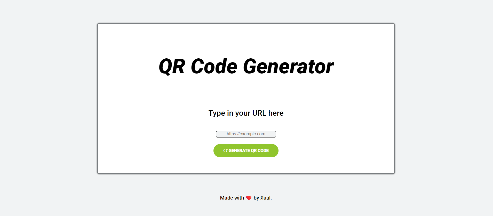

# QR Code Generator

**How to use:** 
1. Make a clone for your local repository
2. Inside 'Backend' folder path, type this in terminal: 'nodemon index.js' (the server will start on PORT 3000 and you can generate QR code now)
    * If you need to install nodemon, [click here](https://www.npmjs.com/package/nodemon) and follow the steps
3. Open any browser and type 'localhost:3000'
4. Enter the desired URL and click on the button to generate the QR code. The QR code will be downloaded in '.png' format automatically.
5. Type 'Ctrl + C' in terminal to stop the server.

*Hope you enjoy it* 🙃  
*Feel free to open an issue and contribute with the project* ❤️ 

**External dependencies used in this project (*ES modules*):**
* 'express'
* 'body-parser'
* 'qr-image'

